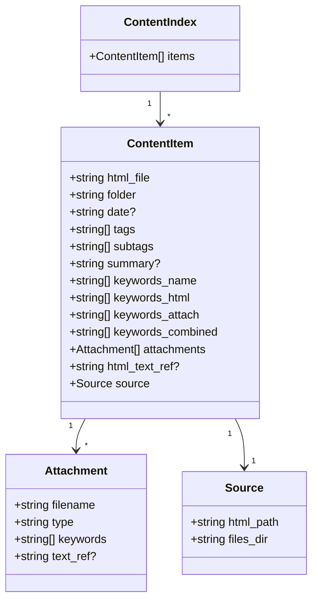

# content_index.json Schema (Diagram)

```mermaid
classDiagram
    class ContentIndex {
      +ContentItem[] items
    }

    class ContentItem {
      +string html_file
      +string folder
      +string date?
      +string[] tags
      +string[] subtags
      +string summary?
      +string[] keywords_name
      +string[] keywords_html
      +string[] keywords_attach
      +string[] keywords_combined
      +Attachment[] attachments
      +string html_text_ref?
      +Source source
    }

    class Attachment {
      +string filename
      +string type
      +string[] keywords
      +string text_ref?
    }

    class Source {
      +string html_path
      +string files_dir
    }

    ContentIndex "1" --> "*" ContentItem
    ContentItem "1" --> "*" Attachment
    ContentItem "1" --> "1" Source
```
